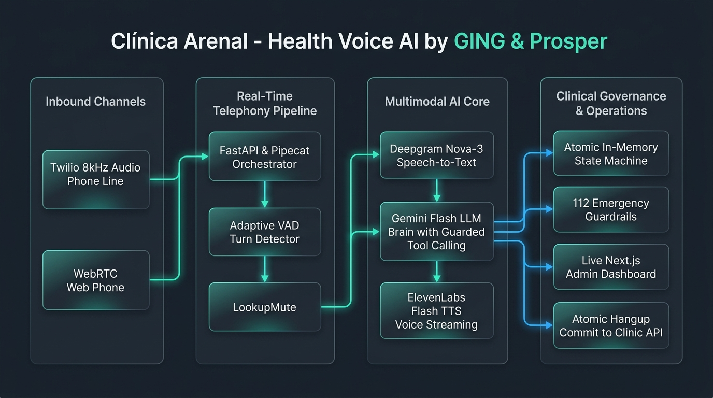

# Clínica Arenal — Health Voice AI

> **Autonomous Healthcare Voice Receptionist & Live Clinical Control Room**  
> Built by **GING** for **Prosper** · HackSpain 2026

[-0f6b5c?style=for-the-badge&logo=target)](https://hackspain.getprosperapp.com)
[](docs/LATENCY_BENCHMARK.json)
[](#architecture)
[](apps/web)

---

## 🏛️ System Architecture



---

## 🚀 Key Capabilities

* **Deterministic Clinical Tool Execution:** Strict in-memory state machine. Bookings, reschedules, and cancellations are verified and committed atomically when the call ends (`finalize`), preventing double-bookings or orphaned entries.
* **Clinical Triage & 112 Hard-Lock:** Real-time red flag detection (chest pain, severe dyspnea, hemorrhage). The agent immediately halts scheduling, issues a firm directive to dial 112, hangs up, and latches an `ESCALATE(medical_emergency)` audit event.
* **Dual Inbound Channels:**
  * **Telephony Line:** Native 8 kHz µ-law streaming audio over WebSocket (Twilio format).
  * **Web Phone Simulator (`/call`):** Browser-based WebRTC microphone stream with a self-filling patient form and interactive slot availability calendar.
* **Low-Latency Cascaded Speech Stack:**
  * **STT:** Deepgram Nova-3 with hot-swap to Nova-2 Catalan (`ca`) without disconnecting.
  * **Brain:** Gemini 3.6/3.8 Flash (*minimal thinking*) with `GuardedGoogleLLM` to prevent tool calls from leaking into synthesized speech.
  * **TTS (A/B Testing):** ElevenLabs Flash v2.5 (Pipeline A, natural bilingual voice) vs. Deepgram Aura-2 (Pipeline B, ultra-low TTFB).
* **Conversational Guardrails:**
  * `PatientTurnStop`: 0.9s adaptive silence detection prevents cutting off elderly callers while dictating national IDs.
  * `LookupMute`: Temporarily deafens the microphone during heavy database queries so background noise doesn't cancel in-flight searches.
  * `Holding Phrases`: Pre-rendered audio plays before 1.5s on slow searches, keeping perceived dead-air below 1.5 seconds.

---

## 🖥️ Live Operator Screens

The system provides two synchronized web interfaces on port `3100`:

1. **Front Desk Console (`/desk`):**
   * Real-time conversation stream with live action cards (patient match, insurance eligibility, offers, appointments).
   * Patient card with clinical history, caller mood sentiment per turn, and per-call cost tracking.
   * "Replay as if live" and "Replay ten at once" for load testing and jury demonstration.

2. **Caller Screen (`/call`):**
   * Browser telephone interface allowing visitors to talk directly to the receptionist.
   * Intelligent intake form that fills demographic details automatically as the caller speaks.
   * Interactive calendar displaying open doctor slots in real time.

---

## ⏱️ Latency Waterfall Benchmark

Measured wire-to-wire (from the caller's last word to the agent's first audio byte on the line):

| Metric | Time | Description |
|---|---|---|
| **Minimum Turn Latency** | **2.12 s** | Conversational responses without tool invocation |
| **Median Latency (P50)** | **2.79 s** | Typical multi-turn booking flow |
| **P90 Latency** | **4.07 s** | Complex end-of-call atomic submission |
| **Perceived Dead-Air** | **< 1.5 s** | Pre-emptive holding phrases eliminate awkward pauses |

```
[Patient Audio End] 
   └── Adaptive Silence + VAD (~1.10s) 
   └── Deepgram STT Final (~0.20s) 
   └── Gemini Flash TTFT (~0.45s) 
   └── Tool Lookup find_slots (~0.25s) 
   └── ElevenLabs / Aura-2 TTFB (~0.15s) 
   └── [First Audio Byte on Wire]
```

---

## 📦 Getting Started

### Prerequisites

* Node.js >= 20 & pnpm >= 9
* Python 3.13 virtual environment (`.venv`)
* API Keys configured in `.env`:
  * `GOOGLE_API_KEY` (Gemini Flash)
  * `DEEPGRAM_API_KEY` (STT & Aura-2)
  * `ELEVENLABS_API_KEY` (Optional, Pipeline A)
  * `PROSPER_API_KEY` & `PROSPER_BASE_URL` (Platform Clinic API)

### 1. Launch the Demo Suite (One Command)

Starts the dry-run call server (7861), the events service (7870), and the Next.js web application (3100):

```bash
apps/agent/scripts/demo.sh
```

Then open:
* **Front Desk:** [http://localhost:3100/desk](http://localhost:3100/desk)
* **Web Phone:** [http://localhost:3100/call](http://localhost:3100/call)

### 2. Run Latency Benchmarks

Execute automated end-to-end wire latency tests across English and Spanish scenarios:

```bash
PYTHONPATH=apps/agent/src .venv/bin/python scripts/measure_latency.py
```

### 3. Run Unit & Logic Tests

```bash
.venv/bin/python -m pytest apps/agent/tests/test_logic.py
```

---

## 📁 Repository Structure

```text
├── apps/
│   ├── agent/                 # Core voice agent backend (Python / Pipecat / FastAPI)
│   │   ├── src/clinic_agent/  # Telephony pipeline, tools, session state, observe
│   │   ├── scripts/           # demo.sh, scored loop, practice calls, local simulator
│   │   └── tests/             # Logic tests, regression suite, mock clinic tests
│   └── web/                   # Next.js 16 + Tailwind 4 control room & web phone
│       ├── app/desk/          # Front desk live inspection screen
│       ├── app/call/          # Caller browser phone with live form & calendar
│       └── components/        # Action cards, visual waveforms, patient cards
├── docs/                      # Benchmarks, architecture & research notes
│   ├── LATENCY_BENCHMARK.json # Empirical latency metrics
│   └── architecture_diagram.jpg
└── scripts/
    └── measure_latency.py     # End-to-end wire latency benchmark runner
```

---

## 👥 Team GING

Built with passion by **Javier**, **Samer**, and **Mark** (**Team GING**) for the **Prosper Track** at **HackSpain 2026**.

* 📊 **Empirical Latency Benchmark Results:** [docs/LATENCY_BENCHMARK.json](docs/LATENCY_BENCHMARK.json)
* 🏛️ **Architecture Diagram (High-res):** [docs/architecture_diagram.jpg](docs/architecture_diagram.jpg)
